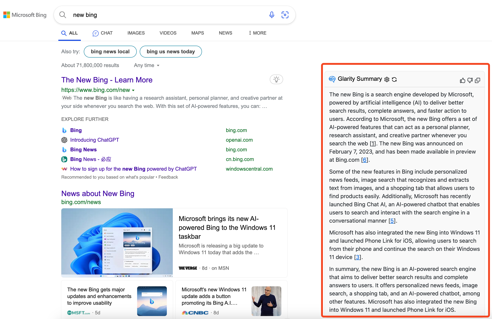
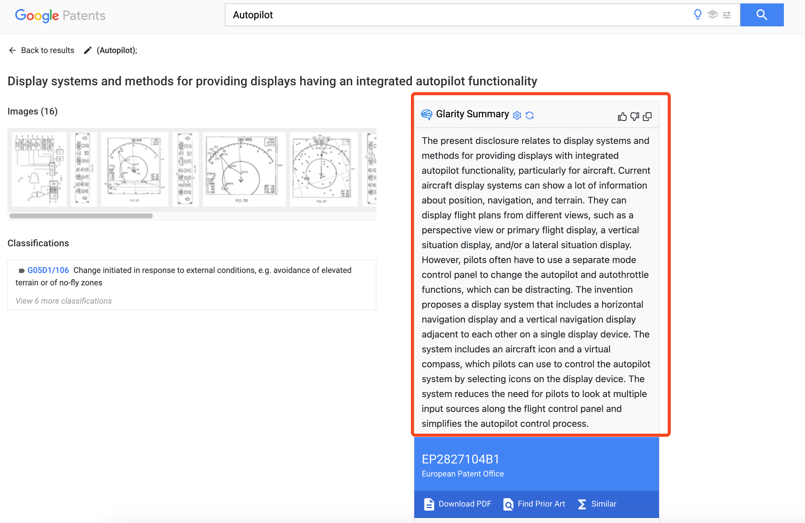
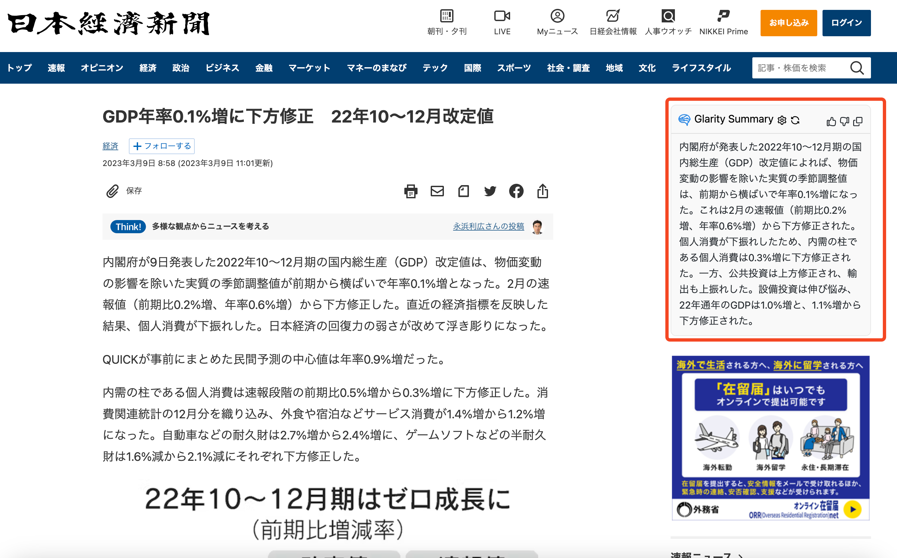

# Glarity - Summary for Google/YouTube with ChatGPT

Chrome extension to view ChatGPT summaries alongside Google search results and YouTube videos, also supports Yahoo! ニュース、PubMed、PMC、NewsPicks、Github、Nikkei、 Bing、Google Patents,and any page summary.

## ⚠️ Tips:

If you cannot choose the OpenAI API model, please delete the plugin and reinstall it.

Or You can try downloading the experience package ([https://github.com/sparticleinc/chatgpt-google-summary-extension/tree/main/packages](https://github.com/sparticleinc/chatgpt-google-summary-extension/tree/main/packages)) and adding it manually ([https://github.com/sparticleinc/chatgpt-google-summary-extension#chrome](https://github.com/sparticleinc/chatgpt-google-summary-extension#chrome)).

## Supported Websites

- Google
- YouTube
- Yahoo! JAPAN ニュース
- PubMed
- PMC
- NewsPicks
- Github
- Nikkei
- Bing
- Google Patents
- Bilibili
- Any website

## Installation

[Add from Chrome Web Store](https://chrome.google.com/webstore/detail/summary-for-google-with-c/cmnlolelipjlhfkhpohphpedmkfbobjc)

[Add from Mozilla Add-on Store](https://addons.mozilla.org/zh-CN/firefox/addon/glarity/)

## Features

- Supports Google search
- Supports YouTube
- Supports Github
- Supports Bing
- Supports Yahoo! JAPAN ニュース
- Supports PubMed
- Supports PMC
- Supports NewsPicks
- Supports Nikkei
- Supports Google Patents
- Support bilibili
- Support summary of any web page
- Support for iOS Safari/ macOS Safari
- Supports the official OpenAI API (GPT-3.5-turbo/text-davinci-003)
- Supports ChatGPT Plus
- Markdown rendering
- Code highlights
- Dark mode
- Provide feedback to improve ChatGPT
- Copy to clipboard
- Switch languages

## Screenshot

### Google

### YouTube

### Bilibili

### iOS Safari /macOS Safari

### Github

### Bing

### Google Patents

### Yahoo! JAPAN ニュース

### PubMed

### PMC

### NewsPicks

### Nikkei

## Troubleshooting

### How to make it work in Brave

Disable "Prevent sites from fingerprinting me based on my language preferences" in `brave://settings/shields`

## Build from source

1. Clone the repo
2. Install dependencies with `npm`
3. `npm run build`

### Packages

- [Chromium](packages/Glarity-chromium.zip)
- [Firefox](packages/Glarity-firefox.zip)

### Chrome

1. Go to `chrome://extensions/`.
2. At the top right, turn on `Developer mode`.
3. Click `Load unpacked`.
4. Find and select extension folder(`build/chromium/`).

### Firefox

1. Go to `about:debugging#/runtime/this-firefox`.
2. Click `Load Temporary Add-on`.
3. Find and select the extension file(`build/firefox.zip`).

## Credit

This project is a fork of [wong2/chatgpt-google-extension](https://github.com/wong2/chatgpt-google-extension), and borrows code from [qunash/chatgpt-advanced](https://github.com/qunash/chatgpt-advanced) & [YouTube Summary with ChatGPT](https://github.com/kazuki-sf/YouTube_Summary_with_ChatGPT)

## License

[GPL-3.0 license](LICENSE).
