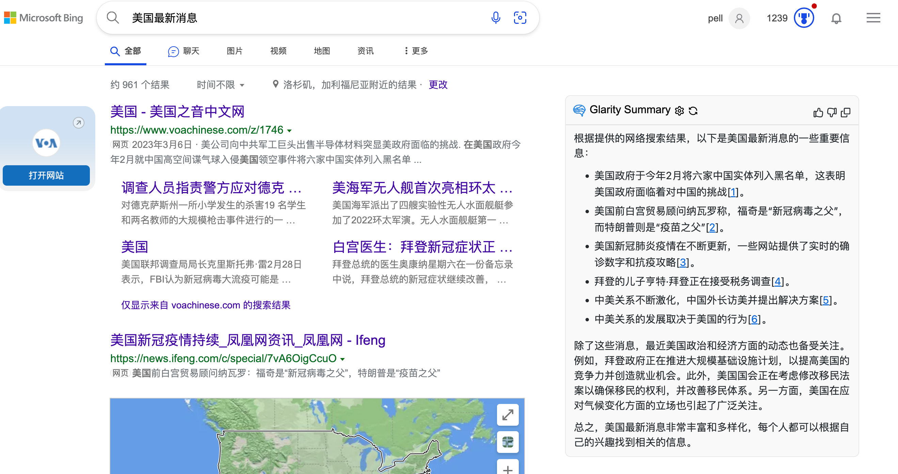

# # Glarity - Summary for Google/YouTube with ChatGPT

Chrome 浏览器扩展实现在 Google 搜索结果和 YouTube 视频旁边展示 ChatGPT 摘要，同时支持 Yahoo! JAPAN ニュース、PubMed、PMC、NewsPicks、Github、Nikkei、Bing、Google Patents, 以及任意网页的总结。

## ⚠️ Tips:

如果遇到不能选择 OpenAI API 模型, 麻烦删除并重新安装。

或者尝试下载最新体验包 ([https://github.com/sparticleinc/chatgpt-google-summary-extension/tree/main/packages](https://github.com/sparticleinc/chatgpt-google-summary-extension/tree/main/packages)) 然后手动安装 ([https://github.com/sparticleinc/chatgpt-google-summary-extension#chrome](https://github.com/sparticleinc/chatgpt-google-summary-extension#chrome)).

## 支持网站

- Google
- YouTube
- Yahoo! 日本新闻
- PubMed
- PMC
- NewsPicks
- Github
- Nikkei
- Bing
- Google Patents
- Bilibili
- 任意网站

## 安装

[Chrome 应用市场](https://chrome.google.com/webstore/detail/summary-for-google-with-c/cmnlolelipjlhfkhpohphpedmkfbobjc)

[Firefox Add-ons 市场](https://addons.mozilla.org/zh-CN/firefox/addon/glarity/)

## 功能

- 支持 Google 搜索
- 支持 YouTube 视频总结
- 支持 Bing 搜索
- 支持 Github 项目总结
- 支持 Google 专利总结
- 支持 Yahoo! JAPAN 新闻总结
- 支持 PubMed 总结
- 支持 PMC 总结
- 支持 NewsPicks 总结
- 支持 Nikkei 总结
- 支持 Bilibili 视频总结
- 支持任意网页的总结
- 支持 iOS Safari/ macOS Safari
- 支持 OpenAI 官方 API（GPT-3.5-turbo/text-davinci-003）
- 支持 ChatGPT Plus
- Markdown 格式渲染
- 代码高亮
- 暗色模式
- 支持 ChatGPT 反馈
- 复制结果
- 切换语言

## 截图

### Google

### YouTube

### Bilibili

### iOS Safari /macOS Safari

### Github

### Bing

### Google Patents

### Yahoo! JAPAN 新闻

### PubMed

### PMC

### NewsPicks

### Nikkei

## 常见问题

### 在 Brave 运行

Disable "Prevent sites from fingerprinting me based on my language preferences" in `brave://settings/shields`

## 手动安装

1. Clone 代码
2. `npm i`
3. `npm run build`

### 扩展包

- [Chromium](packages/Glarity-chromium.zip)
- [Firefox](packages/Glarity-firefox.zip)

### Chrome

1. 打开扩展管理窗口，chrome://extensions
2. 激活开发者模式
3. 载入 `build/chromium/`

### Firefox

1. 打开 `about:debugging#/runtime/this-firefox`
2. 临时载入附加组件
3. 载入 `build/firefox.zip`

## Credit

This project is a fork of [wong2/chatgpt-google-extension](https://github.com/wong2/chatgpt-google-extension), and borrows code from [qunash/chatgpt-advanced](https://github.com/qunash/chatgpt-advanced) & [YouTube Summary with ChatGPT](https://github.com/kazuki-sf/YouTube_Summary_with_ChatGPT)

## License

[GPL-3.0 license](LICENSE).
